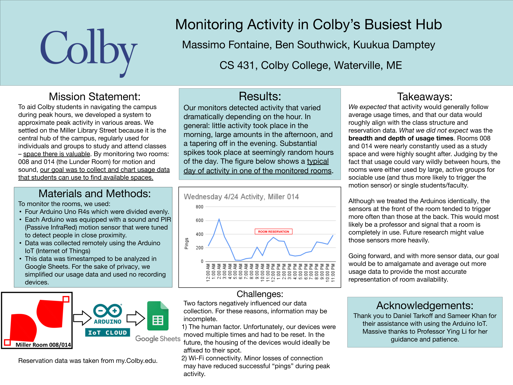

# CS431-foot-traffic

This repository contains the final code for a semester-long project in CS431 Advanced Computer Networks. The goal of this project was to develop an autonomous system that could detect and record activity in an enclosed space (i.e. _foot traffic_) remotely. Foot traffic was detected through the use of Arduinos equipped with IR motion sensors and sound sensors. Every data point was then automatically recorded into a Google Sheet through a Google script connected to Arduino's IoT Cloud. By observing trends in this data, we were able to estimate the typical peak hours of activity in four different classrooms and study spaces. 

I presented this project at the Spring 2024 Colby Liberal Arts Symposium. As a part of this presentation, I used the following poster that detailed our methodology and findings:

